# 🤖 Bitvavo Trading Bot

[](https://github.com/sedegroot-lang/Bitvavo-Bot/stargazers)
[](https://github.com/sedegroot-lang/Bitvavo-Bot/issues)
[](https://www.python.org/)
[](LICENSE)
[](#installatie)
[](https://github.com/sedegroot-lang/Bitvavo-Bot/releases)

Geautomatiseerde crypto trading bot voor [Bitvavo](https://bitvavo.com/invite?a=B8942E4528). Gratis, open source, draait lokaal op je eigen PC.

> **📡 Live Trading Signalen** — Ontvang onze buy/sell signalen in real-time via Telegram:
> **[▶ Join het signaalkanaal](https://t.me/+pDwrMmx107lhNDA0)**
>
> *Laatste 7 dagen: 21 trades, 100% winrate, +€22.59 — volledig automatisch door de bot*

---

## Wat doet de bot?

De bot handelt 24/7 automatisch in crypto op je Bitvavo account. Er zijn drie strategieën:

**1. Trailing Stop Bot**
Koopt als de AI een goed moment ziet, en plaatst een trailing stop die meebeweegt met de prijs. Zodra de prijs terugzakt wordt er automatisch verkocht. Zo worden winsten vastgelegd en verliezen beperkt.

**2. DCA Safety Buys (Dollar Cost Averaging)**
Als een munt daalt na aankoop, koopt de bot bij op lagere niveaus om je gemiddelde instapprijs te verlagen. Volledig instelbaar: hoevaak, hoeveel, en wanneer. Bij herstel sta je daardoor sneller in de winst.

**3. Grid Bot**
Voor zijwaartse markten. De bot koopt op support en verkoopt op resistance. Pakt kleine winsten bij elke schommeling.

**AI Koopscore & Machine Learning**
Een XGBoost model analyseert technische indicatoren (RSI, MACD, SMA, ATR, Bollinger Bands, volume) en geeft elk koopmoment een score van 0 tot 10. Alleen boven de drempel wordt gekocht. Het model leert van je eigen trades en wordt beter naarmate de bot langer draait.

Daarnaast bevat de AI-laag:
- **LSTM neuraal netwerk** voor tijdserie-patronen (optioneel)
- **Reinforcement Learning (RL)** voor dynamische ensemble-gating
- **Marktregime-detectie** (TRENDING_UP / RANGING / HIGH_VOLATILITY / BEARISH) — de bot past zijn strategie automatisch aan
- **Kelly-sizing** voor optimale positiegrootte op basis van historische winrate en volatiliteit
- **Auto-retrain** — het model hertraint automatisch zodra er genoeg nieuwe trades zijn

---

## Waarom een bot?

| | Handmatig | Bot |
|---|---|---|
| Analyseren | Zelf, kost uren per dag | Automatisch, 24/7 |
| Instap timing | Op gevoel | Op basis van AI score |
| Stop loss | Vergeet je makkelijk | Altijd actief, dynamisch |
| Bijkopen bij dip | Vaak te laat | Automatisch op ingestelde niveaus |
| Emoties | FOMO, paniek | Geen: de bot volgt alleen regels |
| Kosten | Je eigen tijd | €0, volledig gratis |

---

## Dashboard

De bot heeft **twee dashboards**, beide starten automatisch met de bot:

### Dashboard V2 — modern + mobiel (NIEUW, **aanbevolen**)
Draait op **http://localhost:5002** — FastAPI backend + Tailwind/Alpine SPA + PWA.

- **Mobiel**: open op je telefoon, "Add to Home Screen" → installeert als app, fullscreen, offline-ondersteuning
- **Snel**: één endpoint `/api/all` ververst alles in 1 round-trip, in-memory cache (5s)
- **Remote toegang**: via Cloudflare Tunnel ([docs/DASHBOARD_V2_TUNNEL.md](docs/DASHBOARD_V2_TUNNEL.md)) bereikbaar van anywhere
- **Tabs**: Overzicht (KPI's + dagelijks/wekelijks PnL grafieken), Trades, AI, Geheugen (BotMemory facts), Shadow Rotatie

Dubbelklik `start_dashboard_v2.bat` om alleen het dashboard te starten zonder de bot.

Volledige docs: [docs/DASHBOARD_V2.md](docs/DASHBOARD_V2.md)

### Dashboard V1 — Flask (legacy)
Draait op **http://localhost:5001** — uitgebreide bestaande UI:

| Tab | Inhoud |
|---|---|
| Portfolio | Portfolio P&L, open trades, winst vandaag |
| Trades | Alle open en gesloten posities |
| AI | AI scores, markt regime, suggesties |
| Analytics | Historische performance, grafieken |
| Performance | Winst/verlies per munt, equity curve |
| Settings | API-sleutels, Telegram, geavanceerde opties |
| Parameters | Alle handelsparameters vanuit het dashboard |
| Notifications | Telegram-notificaties instellen en testen |
| HODL | Wekelijkse DCA voor BTC/ETH |
| Grid | Grid bot status en instellingen |
| Hedge | Hedge-posities en beschermingsstrategieën |
| Reports | Exporteerbare handelrapporten |
| Roadmap | Portfolio groeidoelen en mijlpalen |

### Screenshots

**Portfolio overzicht**
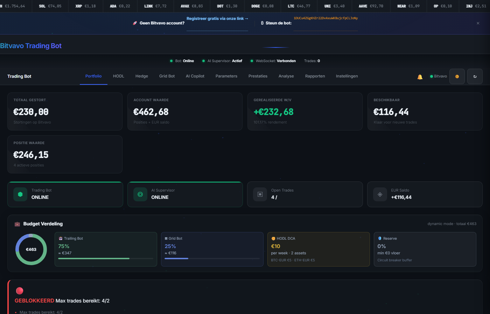

**AI scores en marktanalyse**
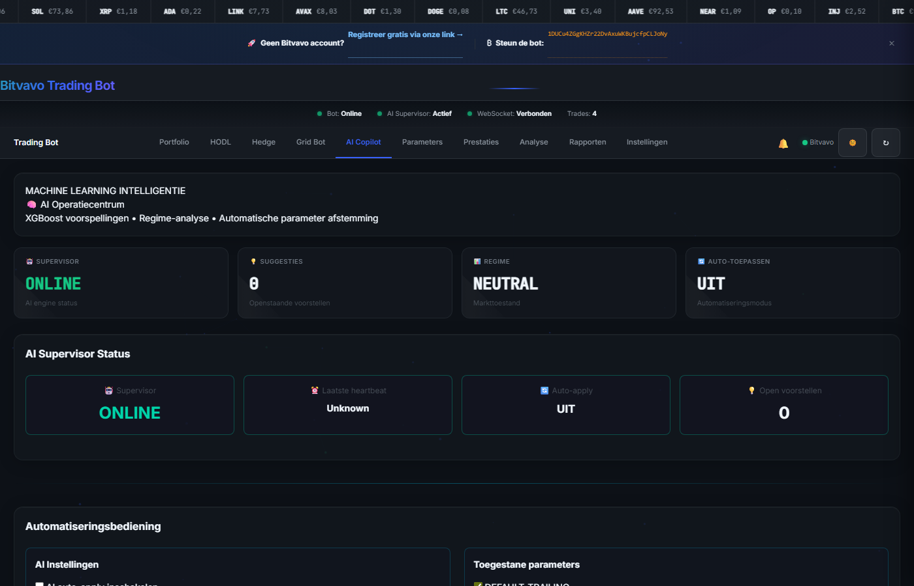

**Performance**
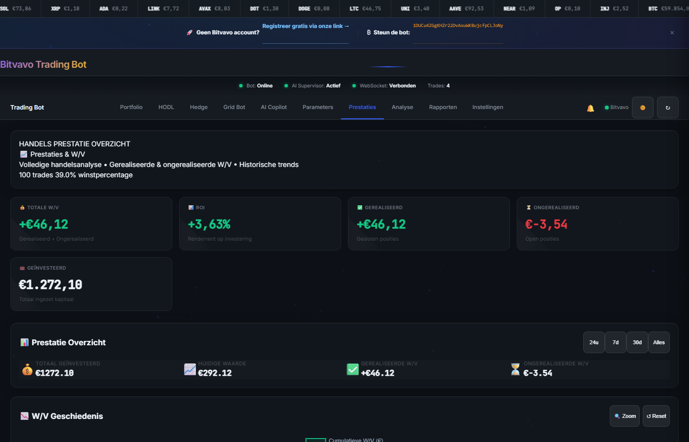

**Analytics**
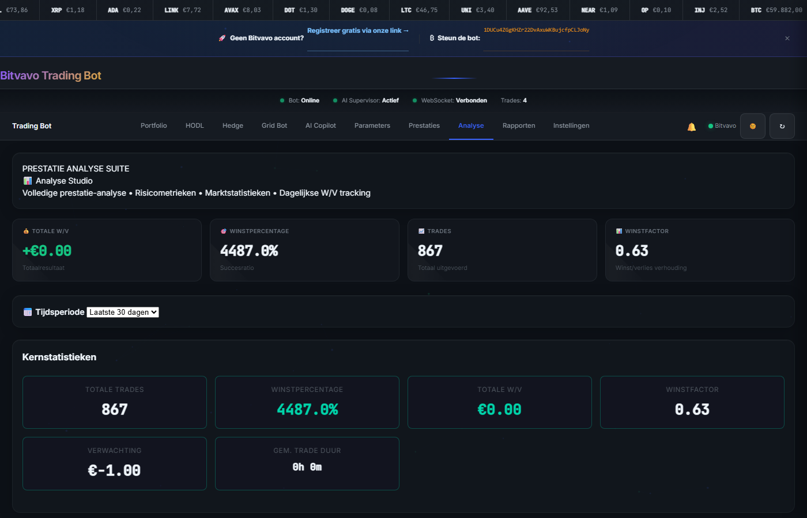

**Instellingen**
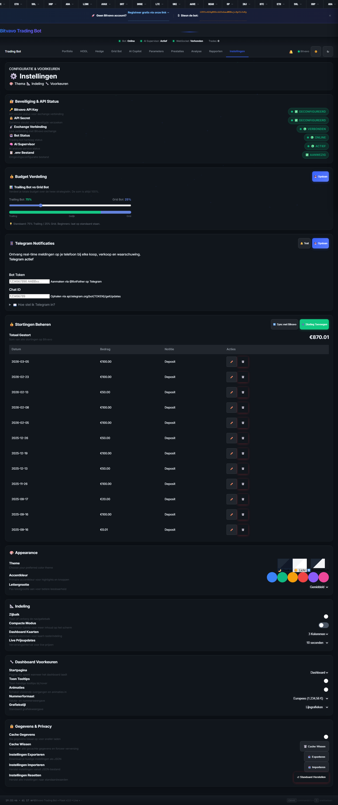

**Grid Bot**
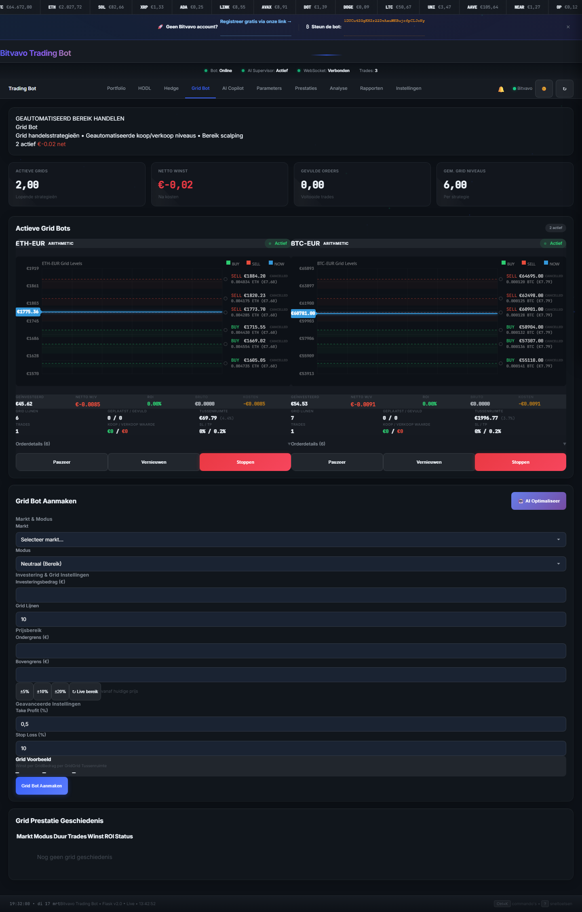

**HODL DCA**
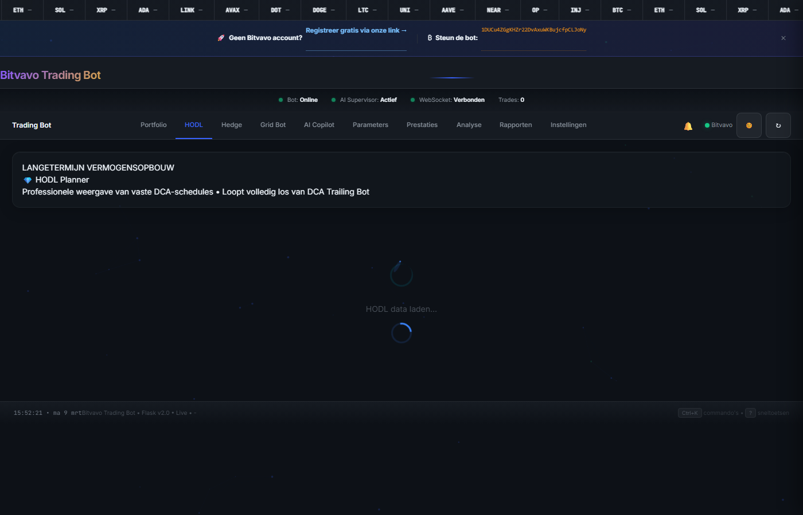

**Hedge**
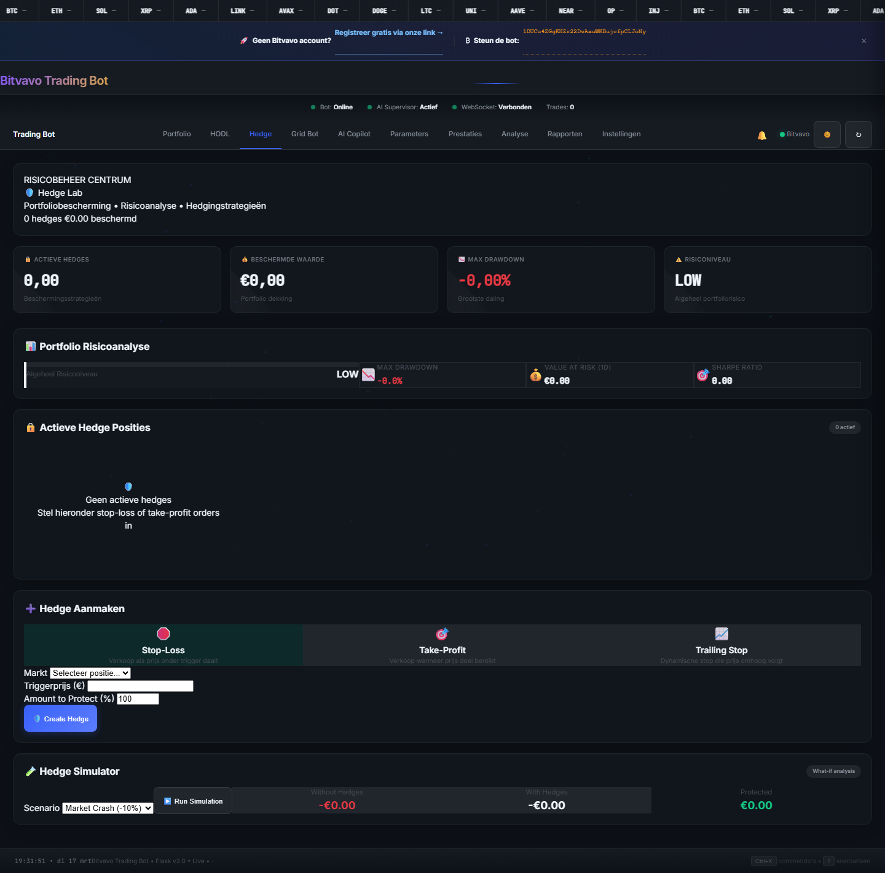

**Notifications**
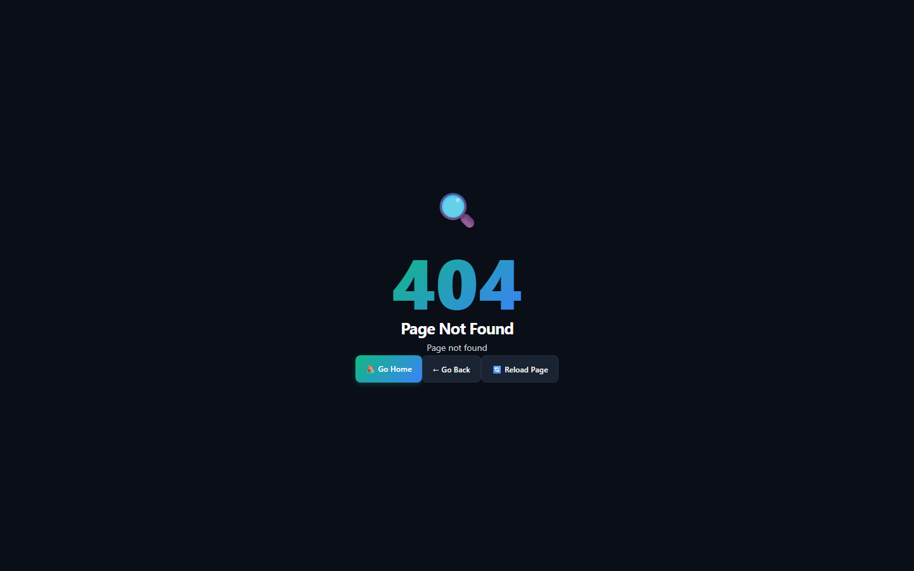

**Parameters**
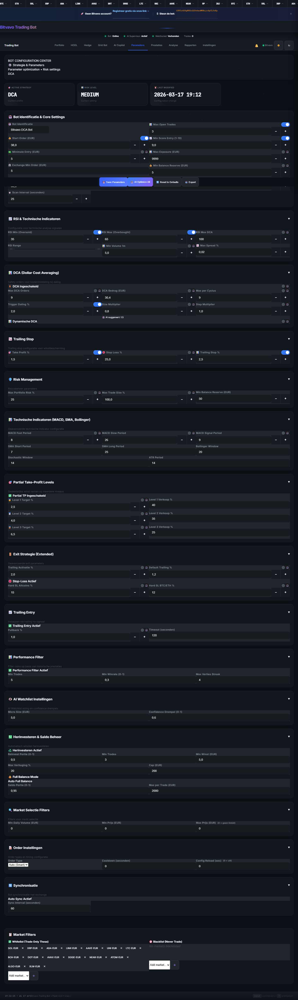

**Rapporten**
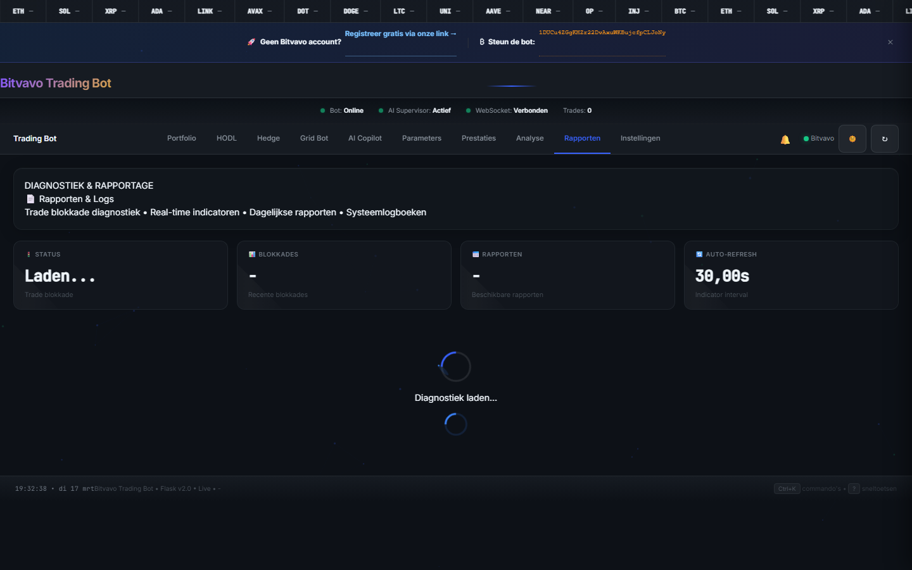

---

## Stap 1: Bitvavo account aanmaken

Registreer via [bitvavo.com/invite?a=B8942E4528](https://bitvavo.com/invite?a=B8942E4528) (affiliate link — je eerste €10.000 aan trades zijn zonder kosten).

Bitvavo is de grootste Nederlandse cryptobeurs, met lage kosten (0,00% tot 0,25%) en een DNB-vergunning. Registratie is gratis en binnen 5 minuten klaar.

Al een account? Ga naar stap 2.

---

## Stap 2: Python installeren

De bot vereist Python 3.11 of hoger (getest met 3.13).

1. Download Python van [python.org/downloads](https://www.python.org/downloads/)
2. Start de installer
3. **Belangrijk:** vink "Add Python to PATH" aan onderaan het installatiescherm
4. Klik "Install Now"

---

## Stap 3: Bot downloaden

[Download de nieuwste versie (ZIP)](https://github.com/sedegroot-lang/Bitvavo-Bot/releases/latest)

1. Klik op Assets en download het ZIP bestand
2. Pak het uit naar een vaste map, bijv. `C:\BitvavoBot\` (zonder spaties)

---

## Stap 4: Installeren via setup wizard

Dubbelklik op `setup.bat` in de uitgepakte map.

De wizard begeleidt je bij:
- Bitvavo API sleutels aanmaken en opslaan
- Telegram notificaties instellen (optioneel)
- Python packages installeren
- Eerste start van de bot

### API sleutels aanmaken

1. Log in op [bitvavo.com](https://bitvavo.com)
2. Ga naar Account → Instellingen → API sleutels
3. Klik "Nieuwe API sleutel aanmaken"
4. Vink aan: **Lezen** en **Handelen**. Vink **Opnemen** NIET aan!
5. Kopieer de Key en Secret (Secret is maar één keer zichtbaar)
6. Plak ze in de wizard

---

## Stap 5: Bot starten

Na de wizard start je de bot met `start_automated.bat`. De dashboards openen op http://localhost:5001 (legacy) en http://localhost:5002 (v2 — aanbevolen).

Sluit het PowerShell-venster niet (dat ís de bot). Minimaliseer het naar de taakbalk.

---

## Parameters instellen

Ga naar http://localhost:5001 → tab Settings:

| Instelling | Wat het doet | Standaard |
|---|---|---|
| Budget per trade | Hoeveel euro per aankoop | €38 |
| Max open trades | Hoeveel munten tegelijk | 2 |
| Trailing stop % | Hoe ver de prijs mag dalen na een top | 2.5% |
| DCA levels | Hoeveel keer bijkopen bij daling | 9x |
| Min AI score | Hoe zeker de AI moet zijn voor aankoop | 7.0 |
| Budget verdeling | % voor Trailing Bot vs Grid Bot | 75% / 25% |

Alle configuratie-opties staan beschreven in [CONFIG_REFERENCE.md](docs/CONFIG_REFERENCE.md).

**Tip:** begin met de standaardinstellingen. Pas alleen het budget per trade aan op je kapitaal. Klein beginnen (€10/trade) is verstandig.

> **Geavanceerd:** De bot gebruikt een 3-lagen config-systeem. Aanpassingen die je wilt bewaren ga je instellen in het lokale override-bestand (`%LOCALAPPDATA%\BotConfig\bot_config_local.json`). Dit bestand heeft altijd voorrang en wordt nooit overschreven door updates.

---

## Telegram notificaties (optioneel)

Ontvang een melding op je telefoon bij elke koop, verkoop of fout.

**Bot aanmaken:**
1. Open Telegram, zoek @BotFather, tik `/newbot`
2. Geef een naam en gebruikersnaam
3. Bewaar het token dat je krijgt (bijv. `8397921391:AAGYxx...`)

**Chat ID ophalen:**
1. Stuur je nieuwe bot een berichtje
2. Open `https://api.telegram.org/bot<JOUW_TOKEN>/getUpdates`
3. Het getal achter `"id":` is je Chat ID

**Instellen:**
Ga naar Settings → Telegram Notificaties. Vul Token en Chat ID in, zet de toggle aan, en klik Opslaan + Test.

---

## Updates

De bot updatet niet automatisch. Bij een nieuwe versie:

1. Ga naar [github.com/sedegroot-lang/Bitvavo-Bot/releases](https://github.com/sedegroot-lang/Bitvavo-Bot/releases)
2. Download de nieuwe ZIP
3. Pak uit in dezelfde map (overschrijf de bestanden)
4. Je `.env` en `config/bot_config.json` blijven bewaard
5. Start de bot opnieuw met `start_automated.bat`

Klik op "Watch" → "Releases only" op GitHub voor e-mailmeldingen bij nieuwe versies.

---

## Documentatie

| Document | Beschrijving |
|---|---|
| [ARCHITECTURE.md](docs/ARCHITECTURE.md) | Technische opbouw van de bot |
| [CONFIG_REFERENCE.md](docs/CONFIG_REFERENCE.md) | Alle configuratie-opties beschreven |
| [DEPLOYMENT.md](docs/DEPLOYMENT.md) | Installatie op Linux, VPS of Docker |
| [TROUBLESHOOTING.md](docs/TROUBLESHOOTING.md) | Veelvoorkomende problemen oplossen |
| [STRATEGY_LOGIC.md](docs/STRATEGY_LOGIC.md) | Hoe de trading strategieën werken |
| [TRADING_STRATEGY.md](docs/TRADING_STRATEGY.md) | Entry/exit logica in detail |
| [PORTFOLIO_ROADMAP_V2.md](docs/PORTFOLIO_ROADMAP_V2.md) | Portfolio groeistrategie en mijlpalen |

---

## Bug melden of hulp nodig?

[Open een Issue op GitHub](https://github.com/sedegroot-lang/Bitvavo-Bot/issues/new)

Vermeld:
- Wat je deed toen het misging
- De foutmelding (kopieer uit het PowerShell-venster)
- Windows versie + Python versie (`python --version`)

Bekijk ook eerst [TROUBLESHOOTING.md](docs/TROUBLESHOOTING.md).

---

## Doneren

Deze bot is gratis en blijft gratis. Wil je de ontwikkeling steunen?

**📡 Signaalkanaal:**
Ontvang live buy/sell signalen van de bot: [Join via Telegram](https://t.me/+pDwrMmx107lhNDA0)

**Bitvavo affiliate:**
Nog geen account? [Registreer via deze link](https://bitvavo.com/invite?a=B8942E4528) — je eerste €10.000 aan trades zijn zonder kosten.

**Bitcoin:**
```
1DUCu4ZGgKHZr22DvAxuWKBujcfpCLJoNy
```

---

## Veiligheid

- API keys staan alleen op jouw PC (`.env` bestand)
- `.env` wordt nooit naar GitHub geüpload (staat in `.gitignore`)
- De bot heeft geen opnamebevoegdheid, alleen lezen en handelen
- Volledig open source, alle code is inzichtelijk

---

## Disclaimer

Cryptocurrency trading brengt financiële risico's met zich mee. Deze bot is een hulpmiddel, geen garantie op winst. Gebruik op eigen risico. Beleg nooit meer dan je kunt missen.

---

## Architectuur

```
trailing_bot.py          Hoofd trading engine (~6.800 regels)
bot/                     Geëxtraheerde botlogica (API wrapper, signalen, trailing, lifecycle)
core/                    Pure berekeningen (indicatoren, regime engine, Kelly sizing, orderbook)
modules/                 Infrastructuur (config, logging, DCA, grid, ML, websocket, dashboard)
ai/                      AI/ML pipeline (XGBoost, LSTM, RL ensemble, auto-retrain, supervisor)
tools/dashboard_v2/      Web dashboard (FastAPI + PWA, poort 5002) — nieuwe enige dashboard sinds 2026-04-29.
tools/dashboard_v2/      Nieuw dashboard (FastAPI + PWA, poort 5002)
scripts/                 Automatisering (scheduler, backup, monitoring)
config/bot_config.json   Bot configuratie (via dashboard of editor)
data/                    Runtime data en trade log
logs/                    Logbestanden
```

Zie [ARCHITECTURE.md](docs/ARCHITECTURE.md) voor de volledige technische opbouw.
